# Playwright Fixtures: Análise Técnica

## 📚 Índice
1. [Introdução](#introdução)
2. [Como Fixtures Funcionam](#como-fixtures-funcionam)
3. [Fluxo de Execução](#fluxo-de-execução)
4. [Arquitetura do Projeto](#arquitetura-do-projeto)
5. [Vantagens](#vantagens)
6. [Desvantagens](#desvantagens)
7. [Quando Usar](#quando-usar)
8. [Referências](#referências)

---

## Introdução

**Fixtures** são um mecanismo do Playwright que permite:
- Compartilhar setup entre testes
- Injetar dependências automaticamente
- Gerenciar ciclo de vida de recursos (setup/teardown)
- Reutilizar código comum

Neste repositório, fixtures são utilizadas para centralizar o acesso aos **Page Objects** através do `PageManager`, abstraindo a complexidade de inicialização e mantendo os testes limpos e legíveis.

---

## Como Fixtures Funcionam

### Conceito Fundamental

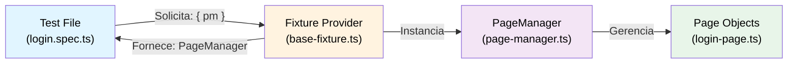

### Estrutura em Camadas

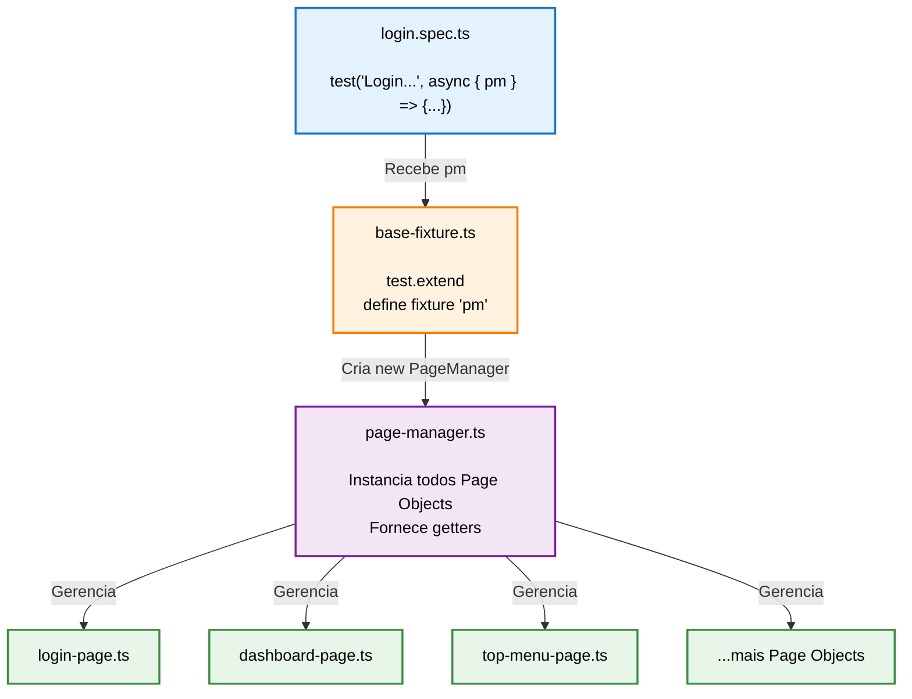

---

## Fluxo de Execução

### Sequência de Inicialização

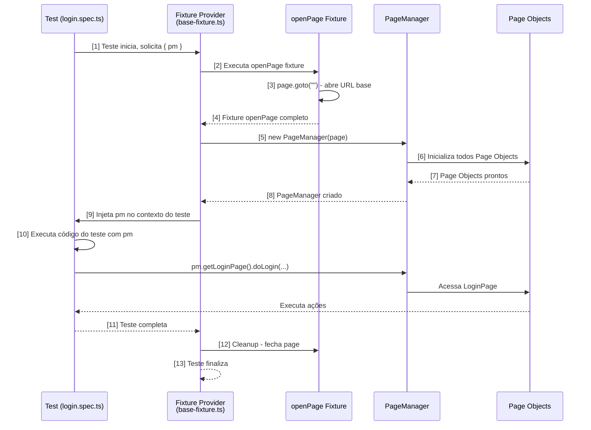

### Ciclo de Vida Completo

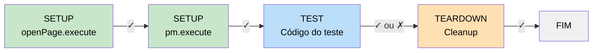

---

## Arquitetura do Projeto

### Estrutura Geral

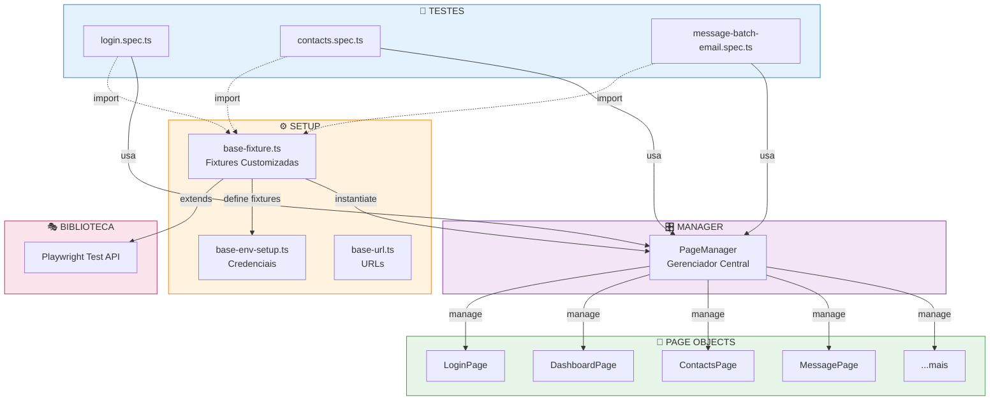

---

## Comparação: Com vs Sem Fixtures

### SEM Fixtures (❌ Duplicação)

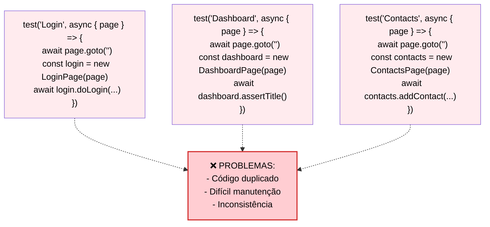

### COM Fixtures (✅ Centralizado)

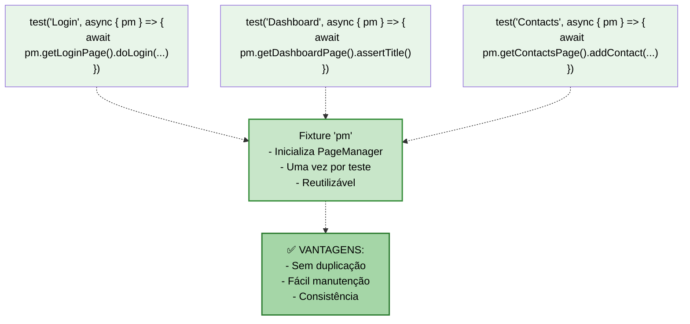

---

## Código: Implementação Passo a Passo

### 1️⃣ Base-Fixture: Definir os Fixtures

```typescript
// tests/setup/base-fixture.ts
import { test as base } from "@playwright/test";
import { PageManager } from "@pages/page-manager";

// Tipagem: o que cada fixture fornece
export type TestOptions = {
  openPage: string;
  pm: PageManager;
};

export const test = base.extend<TestOptions>({
  // Fixture 1: openPage (setup da página)
  openPage: async ({ page }, use) => {
    const URL = await page.goto("");  // Abre a URL base
    console.log("========= Opening ", URL?.url());
    await use("");  // Injeta no próximo fixture
  },

  // Fixture 2: pm (depende de openPage)
  pm: async ({ page, openPage }, use) => {
    // ↑ Recebe page e openPage automaticamente
    const pageManager = new PageManager(page);
    await use(pageManager);  // Injeta no teste
    // Cleanup automático após o teste
  },
});

export { expect } from "@playwright/test";
```

### 2️⃣ PageManager: Centralizar Page Objects

```typescript
// tests/ui/pages/page-manager.ts
import { type Page } from "@playwright/test";
import { LoginPage } from "@pages/general/login-page";
import { DashboardPage } from "@pages/general/dashboard-page";
// ... mais imports

export class PageManager {
  readonly page: Page;
  private readonly loginPage: LoginPage;
  private readonly dashboardPage: DashboardPage;
  // ... mais Page Objects

  constructor(page: Page) {
    this.page = page;
    this.loginPage = new LoginPage(this.page);
    this.dashboardPage = new DashboardPage(this.page);
    // ... inicializa mais Page Objects
  }

  getLoginPage() {
    return this.loginPage;
  }

  getDashboardPage() {
    return this.dashboardPage;
  }
  // ... mais getters
}
```

### 3️⃣ Test: Usar o Fixture

```typescript
// tests/ui/specs/login.spec.ts
import { test } from "@setup/base-fixture";  // Nosso fixture customizado!
import userData from "@data/user-data";

test.describe("Login suite", { tag: ["@login"] }, () => {
  test("Login with valid credentials", async ({ pm }) => {
    // ↑ pm é injetado automaticamente pelo fixture!
    
    await test.step("Login and validate", async () => {
      await pm.getLoginPage().doLogin(username, password);
      await pm.getDashboardPage().assertDashboardTitleIsPresent();
    });
  });
});
```

---

## Vantagens

| # | Vantagem | Descrição | Benefício |
|---|----------|-----------|-----------|
| 1 | **Reutilização** | `openPage` e `pm` são criados uma vez e compartilhados | Menos código duplicado |
| 2 | **Injeção de Dependências** | Fixtures resolvem dependências automaticamente | Código mais limpo |
| 3 | **Isolamento** | Cada teste recebe instância limpa de `pm` | Testes independentes |
| 4 | **Centralização** | Um ponto único (`PageManager`) para acessar Page Objects | Fácil de manter |
| 5 | **Abstração** | Testes não lidam com `page` diretamente | Foco no cenário |
| 6 | **Manutenção** | Mudanças em Page Objects não afetam testes | Menos refatoração |
| 7 | **Lifecycle** | Setup/Teardown automático gerenciado pelo Playwright | Menos código boilerplate |
| 8 | **Type Safety** | TypeScript garante que `pm` tem métodos corretos | Menos erros |

### Exemplo Prático: Vantagem de Centralização

```typescript
// ❌ SEM CENTRALIZAÇÃO - Múltiplos testes, múltiplas inicializações
test("test1", async ({ page }) => {
  await page.goto("");
  const loginPage = new LoginPage(page);
  const dashboard = new DashboardPage(page);
  await loginPage.doLogin(...);
});

test("test2", async ({ page }) => {
  await page.goto("");  // ❌ DUPLICADO
  const loginPage = new LoginPage(page);  // ❌ DUPLICADO
  const contacts = new ContactsPage(page);
  await contacts.addContact(...);
});

// ✅ COM FIXTURES - Um setup, múltiplos testes
test("test1", async ({ pm }) => {
  await pm.getLoginPage().doLogin(...);  // ✅ Simples!
  await pm.getDashboardPage().assertTitle();
});

test("test2", async ({ pm }) => {
  await pm.getContactsPage().addContact(...);  // ✅ Simples!
});
```

---

## Desvantagens

| # | Desvantagem | Descrição | Impacto |
|---|-------------|-----------|--------|
| 1 | **Curva Aprendizado** | Developers precisam entender fixtures e dependências | Onboarding mais longo |
| 2 | **Overhead** | Criação de PageManager a cada teste (mesmo simples) | Performance ligeiramente reduzida |
| 3 | **Menos Controle** | Customização de setup em testes específicos é complexa | Menos flexibilidade |
| 4 | **Debugging Difícil** | Rastrear fluxo entre múltiplas fixtures é confuso | Debugging mais demorado |
| 5 | **Inicialização Completa** | Se um teste precisa de 1 Page Object, todos os 8+ são criados | Desperdício de recursos |
| 6 | **Chaining Profundo** | Fixtures que dependem de outros fixtures | Complexidade aumenta |
| 7 | **Rigidez** | Difícil fazer override de fixtures em testes específicos | Menos flexibilidade |
| 8 | **Encapsulamento** | Pode ocultar detalhes importantes do que está acontecendo | Menos transparência |

### Exemplo: Overhead de Inicialização

```typescript
// ❌ Teste simples que inicializa TUDO
test("only needs LoginPage", async ({ pm }) => {
  // pm.constructor() inicializa:
  // - LoginPage ✓ (usado)
  // - DashboardPage ✗ (não usado)
  // - ContactsPage ✗ (não usado)
  // - DataJobsPage ✗ (não usado)
  // - MessagePage ✗ (não usado)
  // - DiagramPage ✗ (não usado)
  // - KitchenSinkStepsPage ✗ (não usado)
  // - AudiencePage ✗ (não usado)
  
  await pm.getLoginPage().doLogin(...);
});

// ✅ Alternativa: sem fixture para casos simples
test("only needs LoginPage (sem fixture)", async ({ page }) => {
  await page.goto("");
  const loginPage = new LoginPage(page);
  await loginPage.doLogin(...);
});
```

---

## Quando Usar

### ✅ Use Fixtures Quando:

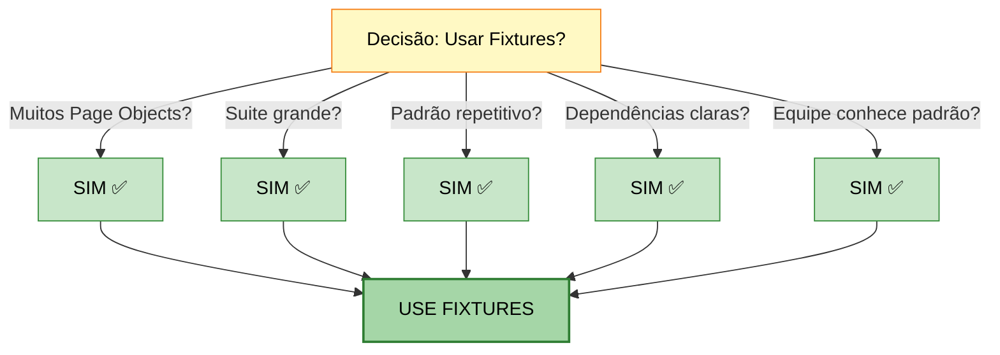

### ❌ Evite Fixtures Quando:

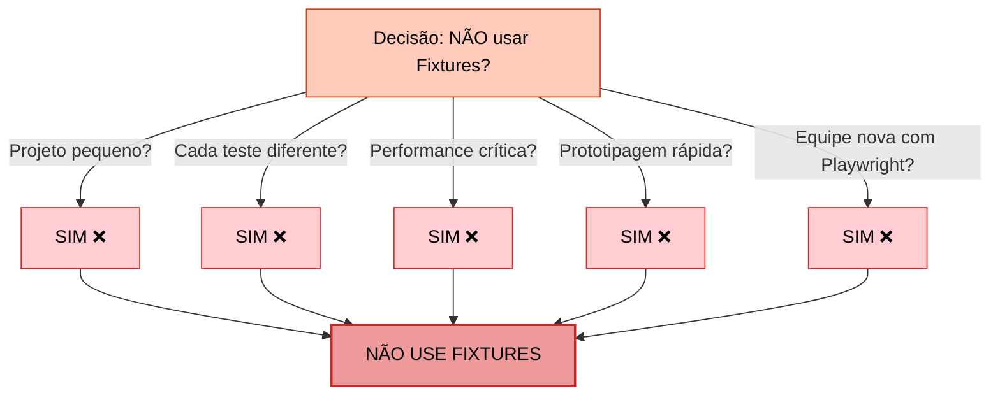

---

## Matriz de Decisão

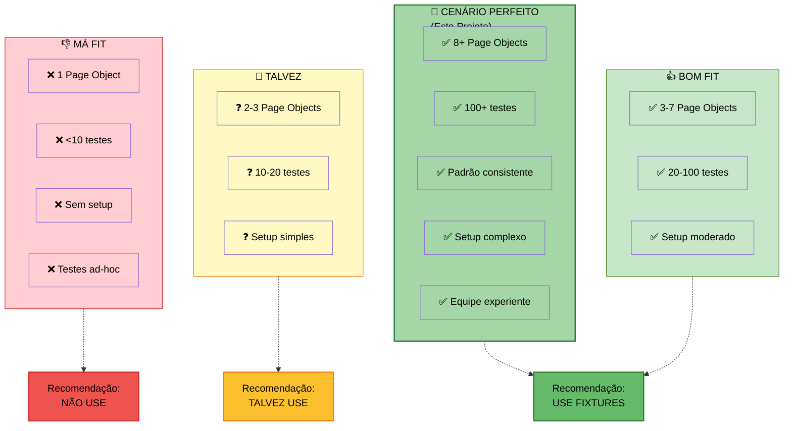

---

## Resumo Técnico

### Injeção de Dependência em Ação

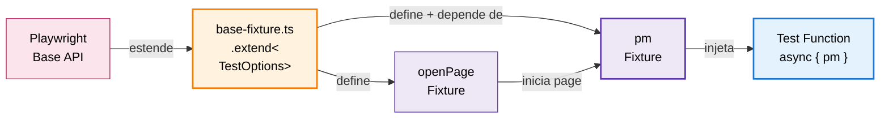

### Ordem de Execução

| # | Etapa | Código | Status |
|---|-------|--------|--------|
| 1 | Playwright inicia | `test.extend<TestOptions>()` | ⏳ Setup |
| 2 | openPage fixture | `page.goto("")` | ⏳ Setup |
| 3 | pm fixture | `new PageManager(page)` | ⏳ Setup |
| 4 | Teste executa | `await pm.getLoginPage()...` | ⏱️ Execução |
| 5 | Cleanup | Fechamento de recursos | ⏸️ Teardown |

---

## Comparação com Outras Abordagens

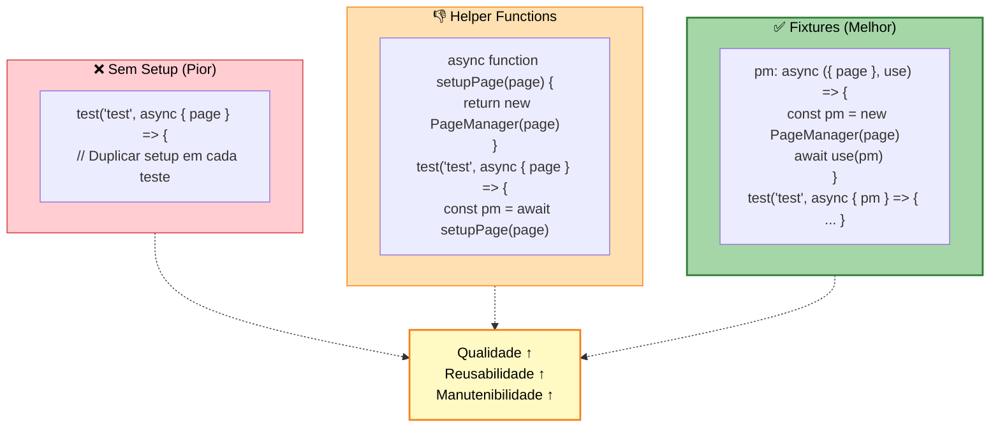

---

## Conclusão

### 📊 Análise Final

Este projeto implementa **fixtures como um padrão de Design Pattern** com:

✅ **Pontos Positivos:**
- Centralização via `PageManager`
- Abstração da complexidade
- Consistência entre testes
- Fácil manutenção e extensão
- Type-safe com TypeScript

⚠️ **Pontos de Atenção:**
- Curva de aprendizado inicial
- Overhead de inicialização completa
- Menos flexibilidade para customizações específicas

### 🎯 Recomendação

**Este projeto faz USO ADEQUADO de fixtures porque:**

1. Possui **múltiplos Page Objects** (8+)
2. Tem **grande volume de testes** (100+)
3. Segue **padrão consistente**
4. Apresenta **dependências claras** (openPage → pm)
5. Prioriza **manutenibilidade e escalabilidade**

### 🚀 Melhorias Possíveis

```typescript
// Fixture opcional para testes simples (lazy loading)
export const test = base.extend<TestOptions>({
  pm: async ({ page, openPage }, use) => {
    // Lazy initialization
    const pageManager = new PageManager(page);
    await use(pageManager);
  },
});

// Fixture para casos específicos
test.extend<{ simpleLogin: LoginPage }>({
  simpleLogin: async ({ page }, use) => {
    await page.goto("");
    await use(new LoginPage(page));
  },
});
```

---

## Referências

- 📖 [Playwright Fixtures Documentation](https://playwright.dev/docs/test-fixtures)
- 🎯 [Playwright Best Practices](https://playwright.dev/docs/best-practices)
- 🏗️ [Page Object Model Pattern](https://playwright.dev/docs/pom)
- 📚 [Dependency Injection Pattern](https://en.wikipedia.org/wiki/Dependency_injection)

---

**Documento gerado em:** 2025-12-06  
**Projeto:** project2 - Playwright Test Suite  
**Versão:** 1.0

